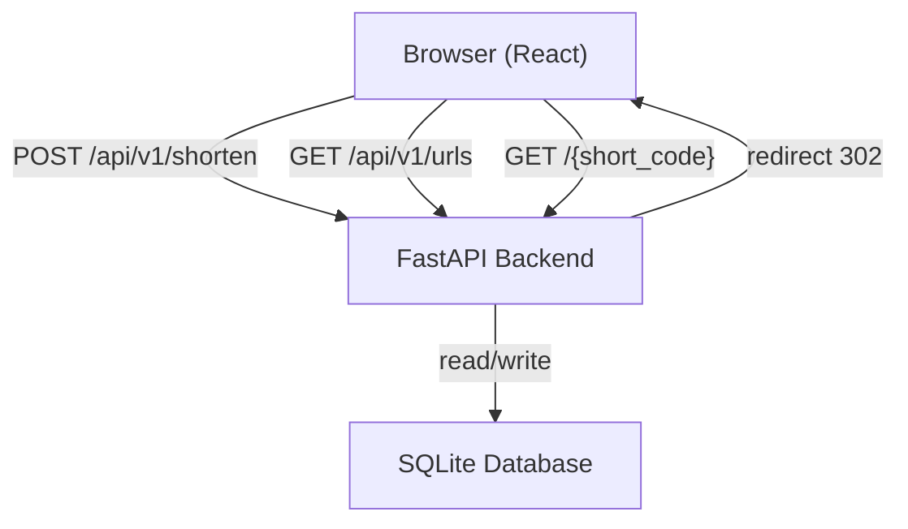
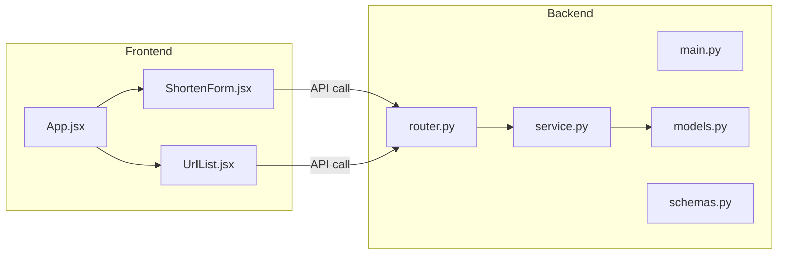

# ARCHITECTURE.md

## System Architecture

## Module Description

## Layers

| Layer | Technology | Role |
|---|---|---|
| Frontend | React + Vite | UI, form, URL жагсаалт |
| API | FastAPI | HTTP handler, validation |
| Service | Python class | Business logic |
| Data | SQLAlchemy + SQLite | Persistence |

## Data Flow

1. Хэрэглэгч URL оруулна → ShortenForm POST хийнэ
2. FastAPI Pydantic-аар validate хийнэ
3. Service layer random short code үүсгэнэ
4. SQLite-д хадгална, response буцаана
5. Богино URL дээр дарахад → redirect 302
6. Click count нэмэгдэнэ
